<div align="center">


<br/>
<br/>

# Aethos Memory

### Universal, Cross-Tool Persistent Memory for AI Assistants



<br/>

> Store preferences, decisions, and project facts **once**.
> Access them everywhere — across **Claude Code, Cursor, Windsurf, Antigravity, OpenCode, Goose** and more — with **zero vendor lock-in**.

<br/>

[](https://github.com/nisargpatel1906/Aethos_Memory)
[](LICENSE)
[](https://python.org)
[](https://nextjs.org)
[](https://gofastmcp.com)
[](https://supabase.com)

<br/>

<table>
  <tr>
    <td align="center"><a href="#why-aethos-memory"><b>Why Aethos</b></a></td>
    <td align="center"><a href="#how-it-works"><b>How It Works</b></a></td>
    <td align="center"><a href="#setup-guide--windows"><b>Windows Setup</b></a></td>
    <td align="center"><a href="#setup-guide--macos"><b>macOS Setup</b></a></td>
    <td align="center"><a href="#mcp-tools"><b>MCP Tools</b></a></td>
    <td align="center"><a href="#privacy--security"><b>Privacy</b></a></td>
  </tr>
</table>

</div>

<br/>

---

## Why Aethos Memory?

Every time you start a new chat, your AI assistant forgets everything — your stack, preferences, project decisions, your name. You repeat yourself every session, across every tool.

**Aethos Memory fixes this.** One MCP server, one database, every AI assistant remembers everything — forever.

<table>
  <tr>
    <th align="left">Without Aethos</th>
    <th align="left">With Aethos Memory</th>
  </tr>
  <tr>
    <td>Repeat your tech stack every new session</td>
    <td>AI already knows your stack from session 1</td>
  </tr>
  <tr>
    <td>Start from scratch in every AI tool</td>
    <td>Claude Code, Cursor, OpenCode share one memory bank</td>
  </tr>
  <tr>
    <td>AI forgets your name and preferences</td>
    <td>Permanent identity and preference store across all tools</td>
  </tr>
  <tr>
    <td>Architecture decisions lost between sessions</td>
    <td>Every decision is stored and retrieved automatically</td>
  </tr>
  <tr>
    <td>Vendor locked to one AI tool</td>
    <td>100% portable — works with any MCP-compatible client</td>
  </tr>
</table>

<br/>

---

## How It Works

```
    Claude Code         OpenCode            Cursor / Windsurf
        |                   |                       |
        | remember()         | recall()              | list_memories()
        v                   v                       v
+---------------------------------------------------------------+
|                    Aethos Memory Server                       |
|              FastMCP + Python + Gemini Embeddings             |
|                                                               |
|   +-----------------------------------------------------+    |
|   |          3-Pass Agentic RAG Retrieval Engine         |    |
|   |  Pass 1: Vector Similarity Search (threshold 0.50)  |    |
|   |  Pass 2: LLM Query Expansion + Broader Retry        |    |
|   |  Pass 3: LLM Relevance Reranking and Filtering      |    |
|   +-----------------------------------------------------+    |
+------------------------------+--------------------------------+
                               |
                               v
+---------------------------------------------------------------+
|                 Supabase Postgres + pgvector                  |
|                   Your Private Context Bank                   |
+---------------------------------------------------------------+
                               ^
                               | View, Edit, Manage
                    +----------+----------+
                    |  Next.js Web App UI |
                    |  localhost:3000     |
                    +---------------------+
```

The AI never sees your full database. Aethos converts queries into 768-dimensional vectors, searches Supabase for the closest matches by cosine similarity, and returns only the relevant facts — fast, private, and precise.

<br/>

---

## Setup Guide — Windows

This guide covers every step from zero to a fully working Aethos Memory setup on **Windows 10 or 11**.

### Prerequisites

Before starting, make sure you have the following installed:

| Tool | Minimum Version | How to Check | Download |
|---|---|---|---|
| Python | 3.10 or higher | `python --version` | [python.org/downloads](https://www.python.org/downloads/) |
| Node.js | 18 or higher | `node --version` | [nodejs.org](https://nodejs.org) |
| Git | Any | `git --version` | [git-scm.com](https://git-scm.com) |

> **Windows tip:** When installing Python, check **"Add Python to PATH"** on the installer screen, or `python` won't be found in PowerShell.

<br/>

### Step 1 — Create Your Free Supabase Database

1. Go to [supabase.com](https://supabase.com) and click **Start your project** — it is free.
2. Sign up with GitHub or email, then click **New project**.
3. Choose a name (e.g. `aethos-memory`), set a database password, and click **Create new project**. Wait about 60 seconds for it to provision.
4. In the left sidebar, click **SQL Editor**.
5. Open the file [`supabase/schema.sql`](supabase/schema.sql) from this repository, copy its entire contents, paste it into the SQL Editor, and click **Run**.

You will see a success message. This creates the `memories` table, pgvector indexes, and the semantic search function that Aethos needs.

<br/>

### Step 2 — Collect Your API Keys

You will need three values from Supabase and one from Google.

**From Supabase Dashboard:**

1. Click **Project Settings** (gear icon in the bottom-left).
2. Click **API** in the settings menu.
3. Copy and save these three values:
   - **Project URL** — looks like `https://abcdefgh.supabase.co`
   - **anon / public key** — starts with `eyJhbGciOi...`
   - **service_role key** — also starts with `eyJhbGciOi...` (keep this private)

**From Google AI Studio (free):**

1. Go to [aistudio.google.com/app/apikey](https://aistudio.google.com/app/apikey).
2. Sign in with your Google account.
3. Click **Create API Key**, choose any project, and copy the key.

**Optional — Groq (for faster fact extraction):**

1. Go to [console.groq.com/keys](https://console.groq.com/keys) and sign up for free.
2. Click **Create API Key** and copy it.

<br/>

### Step 3 — Clone the Repository

Open **PowerShell** and run:

```powershell
git clone https://github.com/nisargpatel1906/Aethos_Memory.git
cd "Aethos_Memory"
```

<br/>

### Step 4 — Set Up the Python MCP Server

In the same PowerShell window, run these commands one at a time:

```powershell
# Move into the server folder
cd server

# Create a Python virtual environment
python -m venv .venv

# Activate the virtual environment
.venv\Scripts\Activate.ps1

# If you see an execution policy error, run this first:
# Set-ExecutionPolicy -ExecutionPolicy RemoteSigned -Scope CurrentUser

# Install Aethos Memory and all dependencies
pip install -e .
```

Now fill in your credentials:

```powershell
# Copy the example credentials file
copy .env.example .env
```

Open the file `server\.env` in Notepad or any editor and fill in your values:

```env
SUPABASE_URL=https://your-project-id.supabase.co
SUPABASE_SERVICE_ROLE_KEY=eyJhbGciOi...your-service-role-key...
GEMINI_API_KEY=AIza...your-gemini-key...
AETHOS_USER_ID=your-supabase-user-uuid
GROQ_API_KEY=gsk_...optional-but-recommended...
AETHOS_PROJECT=global
```

**Finding your User ID:**
1. In the Supabase Dashboard, click **Authentication** in the left sidebar.
2. Click **Users**.
3. If no users exist, go to the web dashboard (Step 5) first and sign up. Your UUID will appear after you connect.

<br/>

### Step 5 — Launch the Web Dashboard (Windows)

From the root of the project, simply **double-click `start.bat`**.

The first time you run it, it will:
1. Install Node.js dependencies automatically (`npm install`)
2. Build the production app (`npm run build`)
3. Start the server on `http://localhost:3000`

After the first run, it will skip the build step and launch instantly.

Alternatively, run manually in PowerShell:

```powershell
cd dashboard
npm install
npm run build
npm start
```

Open [http://localhost:3000](http://localhost:3000) in your browser.

<br/>

### Step 6 — Connect the Dashboard to Supabase (Windows)

1. When you open the dashboard, you will see a **Connect Database** screen.
2. Paste your **Supabase Project URL** and **anon / public key**.
3. Click **Connect**. The dashboard will verify the connection and redirect you to the memory feed.

<br/>

### Step 7 — Find Your User ID (Windows)

1. In the dashboard, navigate to **Settings** (bottom of the left sidebar).
2. Your **Aethos User ID** is shown on the Settings page — it is your Supabase auth UUID.
3. Copy it and paste it as `AETHOS_USER_ID` in `server\.env`.

<br/>

### Step 8 — Connect Aethos to Your AI Tool (Windows)

Go to [http://localhost:3000/setup](http://localhost:3000/setup) in the dashboard. Select your AI tool and OS. The page will generate the exact JSON config you need to paste.

**Claude Code (Windows):**

Add this to `%APPDATA%\Claude\claude_desktop_config.json`:

```json
{
  "mcpServers": {
    "aethos-memory": {
      "command": "C:\\Users\\YourName\\Documents\\Aethos_Memory\\server\\.venv\\Scripts\\python.exe",
      "args": ["C:\\Users\\YourName\\Documents\\Aethos_Memory\\server\\run_mcp.py"]
    }
  }
}
```

**OpenCode (Windows):**

Add this to `%USERPROFILE%\.config\opencode\opencode.jsonc`:

```jsonc
{
  "mcp": {
    "aethos-memory": {
      "type": "local",
      "command": [
        "C:\\Users\\YourName\\Documents\\Aethos_Memory\\server\\.venv\\Scripts\\python.exe",
        "C:\\Users\\YourName\\Documents\\Aethos_Memory\\server\\run_mcp.py"
      ]
    }
  }
}
```

**Cursor / Windsurf (Windows):**

In Cursor settings, find the MCP section and add:

```json
{
  "mcpServers": {
    "aethos-memory": {
      "command": "C:\\Users\\YourName\\Documents\\Aethos_Memory\\server\\.venv\\Scripts\\python.exe",
      "args": ["C:\\Users\\YourName\\Documents\\Aethos_Memory\\server\\run_mcp.py"]
    }
  }
}
```

> Replace `YourName` with your actual Windows username. The credentials are automatically loaded from `server\.env` — you do not need to pass them in the config.

<br/>

### Step 9 — Test It Works (Windows)

Restart your AI tool completely (close and reopen). Then type:

```
Tell me what my name is.
```

The AI will call `aethos-memory_recall` and return what it finds. Then try:

```
My name is [Your Name] and I prefer TypeScript for all projects.
```

The AI will silently call `aethos-memory_remember` and store it. Open a brand new session and ask again — it will remember.

<br/>

---

## Setup Guide — macOS

This guide covers every step from zero to a fully working Aethos Memory setup on **macOS 12 Monterey or later**.

### Prerequisites (macOS)

| Tool | Minimum Version | How to Check | Install |
|---|---|---|---|
| Python | 3.10 or higher | `python3 --version` | `brew install python` or [python.org](https://python.org) |
| Node.js | 18 or higher | `node --version` | `brew install node` or [nodejs.org](https://nodejs.org) |
| Git | Any | `git --version` | Pre-installed on macOS (or `brew install git`) |
| Homebrew | Any | `brew --version` | [brew.sh](https://brew.sh) |

> **Tip:** Open **Terminal** (Applications → Utilities → Terminal) for all commands below.

<br/>

### Step 1 — Create Your Free Supabase Database (macOS)

Same as Windows. See [Step 1 in the Windows guide](#step-1--create-your-free-supabase-database) above — the Supabase web dashboard is identical on all platforms.

<br/>

### Step 2 — Collect Your API Keys (macOS)

Same as Windows. See [Step 2 in the Windows guide](#step-2--collect-your-api-keys) above.

<br/>

### Step 3 — Clone the Repository (macOS)

Open **Terminal** and run:

```bash
git clone https://github.com/nisargpatel1906/Aethos_Memory.git
cd Aethos_Memory
```

<br/>

### Step 4 — Set Up the Python MCP Server (macOS)

```bash
# Move into the server folder
cd server

# Create a Python virtual environment
python3 -m venv .venv

# Activate it
source .venv/bin/activate

# Install Aethos Memory and all dependencies
pip install -e .
```

Fill in your credentials:

```bash
cp .env.example .env
open -e .env    # opens .env in TextEdit
# Or use: nano .env
```

Set these values in `.env`:

```env
SUPABASE_URL=https://your-project-id.supabase.co
SUPABASE_SERVICE_ROLE_KEY=eyJhbGciOi...your-service-role-key...
GEMINI_API_KEY=AIza...your-gemini-key...
AETHOS_USER_ID=your-supabase-user-uuid
GROQ_API_KEY=gsk_...optional-but-recommended...
AETHOS_PROJECT=global
```

<br/>

### Step 5 — Launch the Web Dashboard (macOS)

```bash
cd dashboard
npm install
npm run build && npm start
```

Open [http://localhost:3000](http://localhost:3000) in Safari or Chrome.

<br/>

### Step 6 — Connect Dashboard and Find Your User ID (macOS)

Same as Windows Steps 6 and 7. Connect with your Supabase URL + anon key, then copy your User ID from the Settings page and paste it as `AETHOS_USER_ID` in `server/.env`.

<br/>

### Step 7 — Connect Aethos to Your AI Tool (macOS)

**Claude Code (macOS):**

Edit `~/Library/Application Support/Claude/claude_desktop_config.json`:

```json
{
  "mcpServers": {
    "aethos-memory": {
      "command": "/Users/YourName/Documents/Aethos_Memory/server/.venv/bin/python",
      "args": ["/Users/YourName/Documents/Aethos_Memory/server/run_mcp.py"]
    }
  }
}
```

**OpenCode (macOS):**

Edit `~/.config/opencode/opencode.jsonc`:

```jsonc
{
  "mcp": {
    "aethos-memory": {
      "type": "local",
      "command": [
        "/Users/YourName/Documents/Aethos_Memory/server/.venv/bin/python",
        "/Users/YourName/Documents/Aethos_Memory/server/run_mcp.py"
      ]
    }
  }
}
```

**Cursor (macOS):**

In Cursor → Settings → MCP:

```json
{
  "mcpServers": {
    "aethos-memory": {
      "command": "/Users/YourName/Documents/Aethos_Memory/server/.venv/bin/python",
      "args": ["/Users/YourName/Documents/Aethos_Memory/server/run_mcp.py"]
    }
  }
}
```

> Replace `YourName` with your macOS username. Run `echo $USER` in Terminal if unsure.

<br/>

### Step 8 — Test It Works (macOS)

Same as Windows Step 9. Restart your AI tool and ask:

```
Tell me what my name is.
```

Then store something:

```
My name is [Your Name] and I prefer TypeScript for all projects.
```

Open a new session and ask again — it will remember across sessions and tools.

<br/>

---

## MCP Tools

Aethos Memory exposes **4 core tools** and **3 aliases** for cross-client compatibility:

| Tool | Alias | Description |
|---|---|---|
| `remember` | `save_memory` | Extracts atomic facts from conversation and stores them in vector memory |
| `recall` | `search_memories` | Runs 3-pass semantic search to find the most relevant context for any query |
| `forget` | `delete_memory` | Deletes a stored memory by ID or natural language description |
| `list_memories` | — | Returns all stored memories for a given project tag, unfiltered |

### 3-Pass Agentic RAG Retrieval

| Pass | Strategy | Similarity Threshold |
|---|---|---|
| 1 — Direct Vector Match | Cosine similarity search via pgvector | 0.50 |
| 2 — Query Expansion | LLM rewrites query, searches globally at lower threshold | 0.40 |
| 3 — LLM Reranking | LLM grades all candidates and returns them ordered by relevance | — |

<br/>

---

## Supported AI Tools

<div align="center">

<table>
  <tr>
    <td align="center" width="130"><b>Claude Code</b><br/><sub>CLI and Desktop</sub></td>
    <td align="center" width="130"><b>OpenCode</b><br/><sub>Zen and Build</sub></td>
    <td align="center" width="130"><b>Cursor</b><br/><sub>IDE</sub></td>
    <td align="center" width="130"><b>Windsurf</b><br/><sub>IDE</sub></td>
  </tr>
  <tr>
    <td align="center" width="130"><b>Antigravity</b><br/><sub>AI IDE</sub></td>
    <td align="center" width="130"><b>Goose</b><br/><sub>CLI</sub></td>
    <td align="center" width="130"><b>Cline</b><br/><sub>VS Code Extension</sub></td>
    <td align="center" width="130"><b>Continue</b><br/><sub>VS Code Extension</sub></td>
  </tr>
</table>

</div>

Any tool that supports the **Model Context Protocol (MCP)** works without any changes.

<br/>

---

## Privacy & Security

| Property | Details |
|---|---|
| 100% Self-Hosted | Your memories live exclusively in your own Supabase database |
| Zero Central Servers | No third-party proxy ever touches your data or queries |
| BYOK | Bring Your Own Keys — fully free-tier compatible, zero monthly cost |
| Row-Level Security | All memories scoped to your AETHOS_USER_ID — users are fully isolated |
| Secret-Safe Extraction | API keys and passwords are filtered by the extraction prompt and never stored |
| Project Isolation | Memories tagged per-project: global, backend, dashboard, or any custom tag |

<br/>

---

## Repository Structure

```
Aethos_Memory/
|
+-- Aethos Memory.svg                    Official logo
+-- Aethos-Memory-Master-Workflow.svg    Architecture diagram
+-- start.bat                            1-click web app launcher for Windows
+-- start_all.bat                        Full-stack launcher for Windows
|
+-- supabase/
|   +-- schema.sql                       Postgres + pgvector migration (run once)
|
+-- server/                              Python FastMCP server
|   +-- run_mcp.py                       Entry point, auto-loads .env
|   +-- .env                             Your credentials, never committed to Git
|   +-- .env.example                     Template for new users
|   +-- src/aethos_memory/
|       +-- server.py                    MCP tool definitions
|       +-- retrieval.py                 3-pass Agentic RAG retrieval strategies
|       +-- prompts.py                   Extraction and instruction prompts
|       +-- providers.py                 Gemini embeddings and Groq/OpenRouter LLM
|       +-- db.py                        Supabase pgvector operations
|       +-- config.py                    Environment variable loader
|
+-- dashboard/                           Next.js 14 Web Application
    +-- app/
    |   +-- feed/                        Memory feed and card view
    |   +-- add/                         Add new memories manually
    |   +-- projects/                    Project tag management
    |   +-- settings/                    API keys and Supabase connection
    |   +-- setup/                       MCP config snippet generator
    |   +-- login/                       Authentication and connect flow
    +-- lib/
        +-- supabaseClient.ts            Supabase client and credential helpers
```

<br/>

---

## Support the Project

Aethos Memory is free and open source. If it saves you time and context-switching pain:

- Star the repo — it genuinely helps visibility
- Report bugs in [Issues](https://github.com/nisargpatel1906/Aethos_Memory/issues)
- Share feedback in [Discussions](https://github.com/nisargpatel1906/Aethos_Memory/discussions)
- Submit a PR — contributions are very welcome

<br/>

<div align="center">

Built with care by [Nisarg Patel](https://github.com/nisargpatel1906)

[](https://github.com/nisargpatel1906/Aethos_Memory)

</div>
